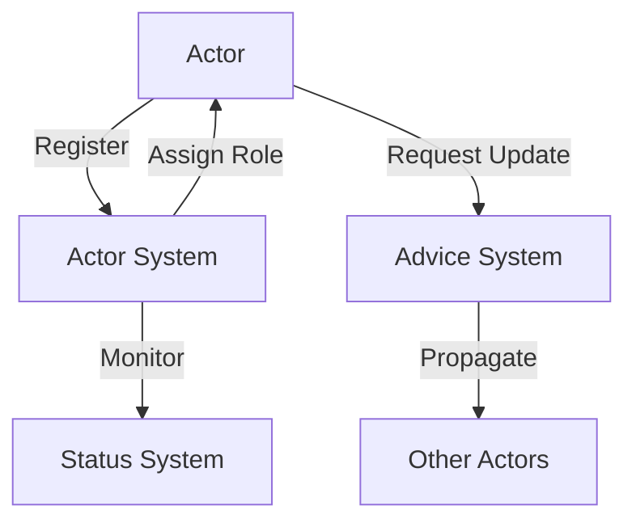

# WhozWho System Patterns

## System Architecture

WhozWho follows an actor-based architecture with several key components working together to provide distributed coordination:

### Core Components

1. **Actor System**
   - Manages actor lifecycle (registration, monitoring, deactivation)
   - Handles role assignment based on actor characteristics
   - Maintains actor state and metadata

2. **Advice System**
   - Coordinates updates across distributed actors
   - Manages the advice lifecycle (creation, propagation, completion)
   - Tracks advice status and completion rates

3. **Status Management**
   - Monitors system health and actor states
   - Provides real-time status reporting
   - Detects anomalies and triggers recovery procedures

## Key Technical Decisions

### Actor Registration and Discovery
- RESTful API-based actor registration instead of automatic discovery
- Explicit check-in mechanism for health monitoring
- Weight-based role assignment for principal determination

### Update Propagation
- Pull-based update model where actors request updates
- Advice-based update coordination
- Versioned update tracking

### Data Persistence
- MongoDB for storing actor and advice data
- Optimized for frequent reads and occasional writes
- Indexes on frequently queried fields

### API Design
- RESTful API for all interactions
- JSON-based communication format
- Stateless request handling

## Design Patterns in Use

### Actor Pattern
- Encapsulates state and behavior in autonomous actors
- Provides message-passing mechanism between actors
- Enables distributed processing and coordination

### Observer Pattern
- Status updates propagate to interested components
- Actors observe advice system for relevant updates
- System monitors observe actor health

### Factory Pattern
- Actor creation through factory methods
- Standardized initialization and configuration
- Consistent actor instantiation

### Repository Pattern
- Data access abstraction for MongoDB
- Separation of data access logic from business logic
- Query optimization and caching

## Component Relationships

### Actor System and Advice System
- Actor System provides role information to Advice System
- Advice System uses role information to determine update targets
- Both systems share actor metadata

### Actor System and Status Management
- Actor System reports actor state changes to Status Management
- Status Management provides health information to Actor System
- Bidirectional flow of status information

### Advice System and Actors
- Actors request advice from Advice System
- Advice System tracks advice delivery and completion
- Actors report back on advice application status

This document outlines the architectural patterns and design decisions that form the foundation of the WhozWho system. It should be referenced when making architectural decisions to ensure consistency with the established patterns.
