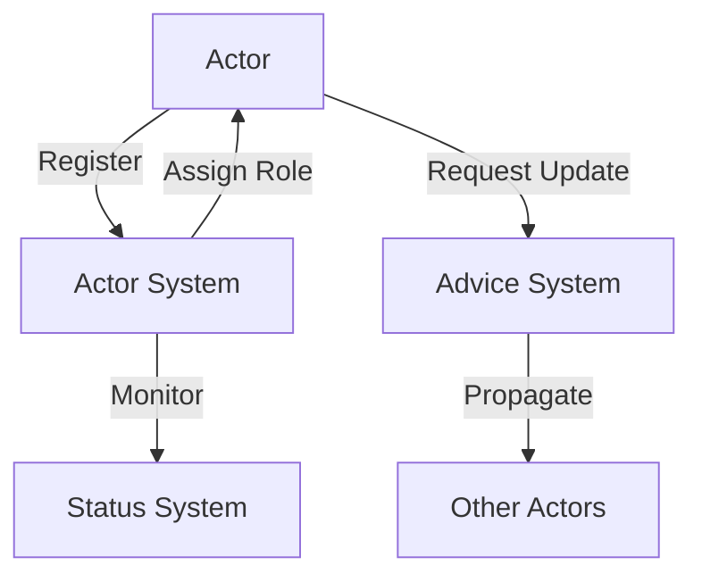

# 🎭 WhozWho

[](https://github.com/mlefree/whozwho/actions/workflows/ci.yml)
[](https://nodejs.org)
[](https://www.typescriptlang.org)
[](https://expressjs.com)
[](https://www.mongodb.com)
[](CHANGELOG.md)

> An actor-based system for managing distributed updates and role assignments.

## 🌟 Features

- **🎭 Actor Management**: Dynamic actor registration and lifecycle tracking
- **👑 Role Assignment**: Smart principal role determination based on weight and activity
- **🔄 Update Coordination**: Distributed update propagation with advice system
- **🎯 Status Tracking**: Real-time status monitoring of actors
- **🔒 Robust Error Handling**: Comprehensive error management and recovery

For detailed feature information, see [CHANGELOG.md](CHANGELOG.md) and [specs/REQUIREMENTS.md](specs/REQUIREMENTS.md).

## 📚 Documentation

### Memory Bank

This project uses a Memory Bank for comprehensive documentation and context retention. The Memory Bank is located in the
`.memory-bank` directory and contains the following files:

- `memory-bank-rules.md`: Rules to follow and to consider in all contexts
- `projectbrief.md`: Overview of the project, core requirements, and goals
- `productContext.md`: Why the project exists, problems it solves, and how it works
- `systemPatterns.md`: System architecture, key technical decisions, and design patterns
- `techContext.md`: Technologies used, development setup, and technical constraints
- `activeContext.md`: Current work focus, recent changes, and next steps
- `progress.md`: What works, what's left to build, and known issues

=> !! These files should always be considered as a context and kept up-to-date !!

## 🚀 Quick Start

### Installation

```bash
# Clone the repository
git clone https://github.com/mlefree/whozwho.git

# Install dependencies
npm install

# Set up environment
cp .env.example .env
```

### Configuration

Update your `.env` file with appropriate values:

```env
NODE_ENV=development
MONGODB_URI=mongodb://localhost:27017/whozwho
PORT=3003
```

### Running the Application

```bash
# Development mode
npm run dev

# Production mode
npm start

# Run tests
npm test
```

## 🔄 CI/CD

The project uses GitHub Actions for continuous integration and deployment:

- **Test Workflow**: Runs on push/PR to main/master branches
    - Tests with Node.js 22.x
    - Runs the test suite
    - Builds the TypeScript application
    - Pushes compiled output to `app` branch

### Branches

- `main`: Main development branch
- `sandbox`: Contains ???
- `deployed-to-sandbox`: Contains ??

## 🎯 API Endpoints

### Actor Management

```http
POST /hi        # Register actor's presence and status
POST /actors    # Query actor's role status
GET /status     # Get system status
```

### Advice Management

```http
POST /advices             # Suggest advice to actor's categories
GET /advices              # Get my last advices
PUT /advices/:adviceId    # Update advice status
```

The advice system currently supports `UPDATE` for coordinating version updates across actors.

For detailed API specifications and future planned advice types,
see [specs/REQUIREMENTS.md](specs/REQUIREMENTS.md#api-requirements).

## 🏗 Architecture

The system follows an actor-based architecture with the following key components:

- **Actor System**: Manages actor lifecycle and role assignment
- **Advice System**: Coordinates updates across distributed actors
- **Status Management**: Tracks system health and actor states



## 🧪 Testing

The project includes comprehensive test coverage:

```bash
# Run all tests
npm test

# Run specific test suite
npm run test-mocha-integration
```

## 📦 Dependencies

- `express`: Web framework
- `mongoose`: MongoDB ODM
- `typescript`: Type support
- `npm-run`: Process management

For detailed technical requirements, see [specs/REQUIREMENTS.md](specs/REQUIREMENTS.md#technical-requirements).

## 🤝 Contributing

1. Fork the repository
2. Create your feature branch (`git checkout -b feature/amazing-feature`)
3. Commit your changes (`git commit -m 'Add some amazing feature'`)
4. Push to the branch (`git push origin feature/amazing-feature`)
5. Open a Pull Request

## Release process

1. Make sure documentation is up to date before releasing:
    - README.md (badges, version numbers)
    - CHANGELOG.md (anticipate the version that will bump, documentate changes, make sure dates are corrects based on
      git tag history)
    - Memory bank files

2. Run the following scripts to bump version, commit, and push changes:
   ```bash
   npm run bp:bump        # Bump version, update bpInfo.ts, and create a new branch
   npm run bp:branch:push # Commit changes with standardized message and push
   ```

This will:

- Increment the patch version in package.json
- Update the bpInfo.ts file with the new version
- Create a new branch with the version name
- Add all changed files to git
- Commit with a standardized message
- Push to the new branch

The CI workflow will then:

- Run tests
- Build the application
- Push the compiled output to the deployed-in-sandbox branch
- Create version tags on both deployed-in-sandbox and main branches

## 📄 License

This project is licensed under the MIT License - see the [LICENSE](LICENSE) file for details.

## 🙏 Acknowledgments

- Express.js team for the amazing web framework
- MongoDB team for the robust database
- The open-source community for continuous inspiration

## 📋 Changelog

Current version: 1.2.3 (Released 2025-05-21)

See [CHANGELOG.md](CHANGELOG.md) for detailed release notes and version history,

---

<p align="center">Made with ❤️ by mlefree</p>
