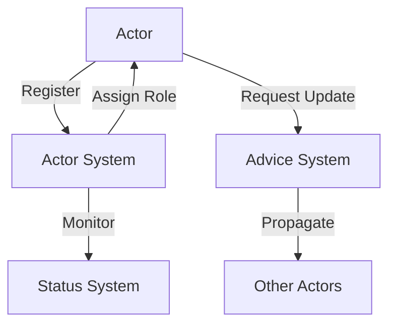

# 🎭 WhozWho

[](https://github.com/mlefree/whozwho/actions/workflows/test.yml)
[](https://nodejs.org)
[](https://www.typescriptlang.org)
[](https://expressjs.com)
[](https://www.mongodb.com)

> An actor-based system for managing distributed updates and role assignments.

## 🌟 Features

- **🎭 Actor Management**: Dynamic actor registration and lifecycle tracking
- **👑 Role Assignment**: Smart principal role determination based on weight and activity
- **🔄 Update Coordination**: Distributed update propagation with advice system
- **🎯 Status Tracking**: Real-time status monitoring of actors
- **🔒 Robust Error Handling**: Comprehensive error management and recovery

## 🚀 Quick Start

### Prerequisites

- Node.js (v22.x)
- MongoDB (v4.4+)
- TypeScript (v4+)

### Installation

```bash
# Clone the repository
git clone https://github.com/mlefree/whozwho.git

# Install dependencies
npm install

# Set up environment
cp .env.example .env
```

### Configuration

Update your `.env` file with appropriate values:

```env
NODE_ENV=development
MONGODB_URI=mongodb://localhost:27017/whozwho
PORT=3006
```

### Running the Application

```bash
# Development mode
npm run dev

# Production mode
npm start

# Run tests
npm test
```

## 🔄 CI/CD

The project uses GitHub Actions for continuous integration and deployment:

- **Test Workflow**: Runs on push/PR to main/master branches
  - Tests with Node.js 22.x
  - Runs the test suite
  - Builds the TypeScript application
  - Pushes compiled output to `app` branch

### Branches

- `main`: Main development branch
- `app`: Contains only the compiled TypeScript output (app/ directory, auto-updated by CI)

## 🎯 API Endpoints

### Actor Management

```http
POST /hi
# Register actor's presence and status

POST /actors
# Query actor's role status

GET /status
# Get system status
```

### Update Management

```http
POST /advices
# Request update advice

GET /advices
# Get pending advices

PUT /advices/:adviceId
# Update advice status
```

## 🏗 Architecture

The system follows an actor-based architecture with the following key components:

- **Actor System**: Manages actor lifecycle and role assignment
- **Advice System**: Coordinates updates across distributed actors
- **Status Management**: Tracks system health and actor states



## 🧪 Testing

The project includes comprehensive test coverage:

```bash
# Run all tests
npm test

# Run specific test suite
npm run test-mocha-integration
```

## 📦 Dependencies

- `express`: Web framework
- `mongoose`: MongoDB ODM
- `typescript`: Type support
- `npm-run`: Process management

## 🤝 Contributing

1. Fork the repository
2. Create your feature branch (`git checkout -b feature/amazing-feature`)
3. Commit your changes (`git commit -m 'Add some amazing feature'`)
4. Push to the branch (`git push origin feature/amazing-feature`)
5. Open a Pull Request

## 📄 License

This project is licensed under the MIT License - see the [LICENSE](LICENSE) file for details.

## 🙏 Acknowledgments

- Express.js team for the amazing web framework
- MongoDB team for the robust database
- The open-source community for continuous inspiration

---

<p align="center">Made with ❤️ by mlefree</p>
